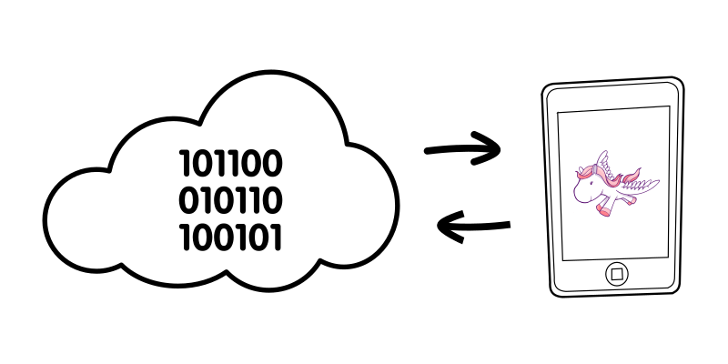

:title: Lets do some Docker
:css: styles.css

----

Lets do some Docker
===================

.. container:: author

    by **Florent Pigout** @toopy

----

:data-y: r+750

The Website
===========

----

:data-rotate-y: 180
:data-y: r+750

The Other Side
==============

.. image:: step-3_the-other-side.svg
   :align: center

----

:data-rotate-z: 90
:data-scale: .3
:data-x: r-250
:data-y: r+750

The Deploy
==========

.. image:: step-4_the-deploy.svg
   :align: center

----

:data-x: 0

The CI
======

.. image:: step-5_the-ci.svg
   :align: center

----

:data-x: r+250

The Dev
=======

.. image:: step-6_the-dev.svg
   :align: center

----

:data-rotate-z: 90
:data-scale: 1
:data-x: 0
:data-y: r+1000

The Stack
=========

.. container:: versions

    * Python *2.7*
    * Django *1.6*
    * Postgresql *9.1*
    * Elasticsearch *0.9*

----

:data-rotate-x: 180
:data-x: r+750

The V2
======

.. container:: versions

    * Python *3.4*
    * Django *1.7*
    * Postgresql *9.4*
    * Elasticsearch *1.3*

----

:data-rotate-z: 180
:data-scale: .3
:data-x: r+750
:data-y: r-250

The Dev
=======

----

:data-y: r+250

The CI
======

----

:data-y: r+250

The Deploy
==========

----

:data-rotate-z: 45
:data-scale: 1
:data-x: r+750
:data-y: r-500

Why not Docker ?
================

----

:data-rotate-z: 90
:data-scale: .3
:data-y: r-750

The Dev
=======

----

:data-x: r+250

The CI
======

----

:data-x: r+250

The Deploy
==========

----

:data-rotate-z: 0
:data-scale: 1
:data-x: r-250
:data-y: r-750

But How ?
=========

----

:data-rotate-y: 225
:data-rotate-z: -45
:data-scale: 0.4
:data-x: r+250
:data-y: r-750

The Pull
========

.. code-block:: bash

    $ docker pull debian:latest

----

:data-rotate-y: 180
:data-x: r-500

The Build
=========

.. code-block:: bash

    $ echo "
    > FROM debian:latest
    > RUN apt-get update
    > RUN apt-get install -y python
    > CMD python --version
    > " > Dockerfile
    $ docker build -t python .

----

:data-rotate-y: 225
:data-y: r-500
:data-x: r+250

The Run
=======

.. code-block:: bash

    $ docker run -it python
    Python 2.7.3

----

:data-rotate-y: 180
:data-x: r-500

The Push
========

.. code-block:: bash

    $ docker run -p 5000:5000 registry
    $ export TAG=localhost:5000/toopy/python
    $ docker tag python $TAG
    $ docker push $TAG

----

:data-rotate-y: 0
:data-rotate-z: 90
:data-scale: 1
:data-x: r-750
:data-y: r-250

The Demo
========

----

:data-rotate-x: 0
:data-rotate-y: 0
:data-rotate-z: 0
:data-scale: 0.1
:data-x: 1250
:data-y: 1500
:data-z: -10000

Questions
=========

.. image:: step-22_questions.svg
   :align: center

----

:data-rotate-x: 0
:data-rotate-y: 0
:data-rotate-z: 0
:data-scale: 17.5
:data-x: 1200
:data-y: 1500
